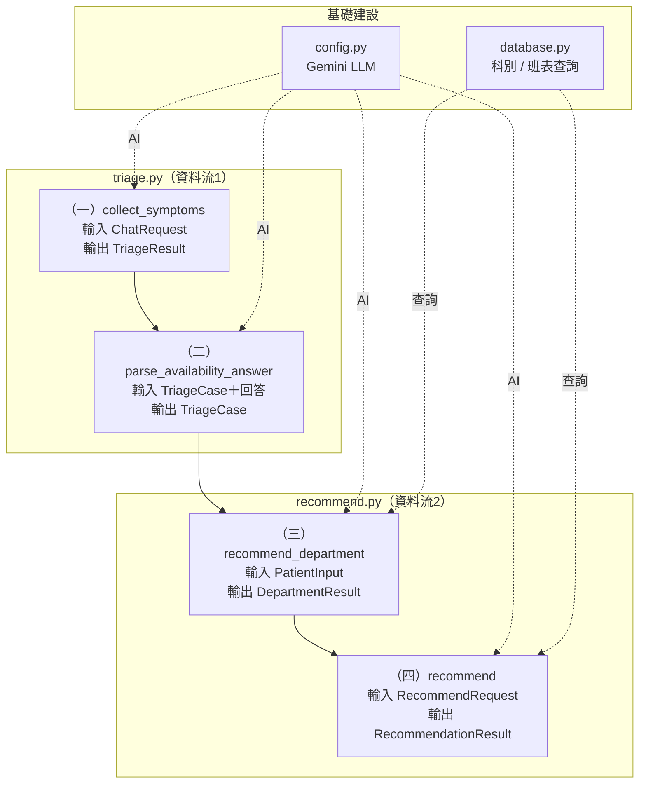

# 智慧分診導引系統 — 後端四大邏輯說明

## 前提：與資料庫串聯

四個邏輯都建立在「**AI 判斷 + 資料庫提供即時資料**」的分工上：

- **連線**：用 `pyodbc` 連 **Azure SQL Database**（`get_db_connection`）
- **五張核心表**：父科別、子科別、醫師、醫師科別關聯、班表
- **三個查詢函式**：
  - `get_active_dept_names`：載入科別名清單（啟動用）
  - `get_departments_with_category`：撈「父科別＋子科別＋dept_id」
  - `get_available_schedules`：查某科可掛號的醫師班表
- **分工原則**：AI 負責「語意理解與判斷」，資料庫負責「即時的科別／醫師／班表」

> 一份病歷 `triage_case`（JSON）貫穿四個邏輯，`case_id` 全程不變。

---

## 系統架構圖（檔案 → 方法 → 輸出 class）



| 邏輯 | 檔案 | 方法 | 輸入 class | 輸出 class |
|---|---|---|---|---|
| （一）症狀收集 | `triage.py` | `collect_symptoms()` | `ChatRequest` | `TriageResult` |
| （二）偏好收集 | `triage.py` | `parse_availability_answer()` | `TriageCase`＋回答 | `TriageCase` |
| （三）科別判斷 | `recommend.py` | `recommend_department()` | `PatientInput` | `DepartmentResult` |
| （四）推薦醫師 | `recommend.py` | `recommend()` | `RecommendRequest` | `RecommendationResult` |

---

## 資料結構（class）欄位對照

> 實作上為 JSON（Python dict），以下以概念上的 class 呈現。

### 核心病歷：`TriageCase`（貫穿四個邏輯的同一份）
| 欄位 | 型別 | 說明 |
|---|---|---|
| `case_id` | str | 病歷編號，全程不變 |
| `history_records` | list | 對話紀錄 |
| `patient_input` | `PatientInput` | 症狀資料 |
| `availability` | `Availability` | 可看診時段 |
| `preferences` | `Preferences` | 就診偏好 |
| `triage` | `Triage` | 急迫度 |
| `conversation_state` | obj | `{stage, is_complete}` |
| `department_result` | `DepartmentResult` \| null | 科別判斷結果（第三步才填） |

### `PatientInput`（症狀，第一步產出）
| 欄位 | 型別 | 說明 |
|---|---|---|
| `symptom` | str | 主要症狀 |
| `body_part` | str \| null | 部位 |
| `duration` | str \| null | 持續多久 |
| `severity` | str \| null | 嚴重度 |
| `onset` | str \| null | 怎麼開始的 |
| `accompanying_symptoms` | list[str] | 伴隨症狀 |
| `red_flags` | list[str] | 危險警訊 |

### `Availability`（時段，第二步產出）
| 欄位 | 型別 | 說明 |
|---|---|---|
| `available_slots` | list[{day, session}] | 可看診的「星期+時段」組合；空=不限 |
| `can_take_leave` | bool | 能否請假 |

### `Preferences`（偏好，第二步產出）
| 欄位 | 型別 | 說明 |
|---|---|---|
| `specialty_priority` | bool | True=科別優先、False=時間優先 |
| `doctor_preference` | str | 指定醫師 / 不限 |
| `hospital_preference` | str | 醫院（台北榮總） |

### `Triage`（急迫度，第一步產出）
| 欄位 | 型別 | 說明 |
|---|---|---|
| `urgency_level` | str | `high`（急診）/ `normal`（一般門診） |
| `urgency_score` | int | high=90、normal=0 |
| `warning_required` | bool | 是否要警告 |
| `warning_message` | str \| null | 警告文案 |
| `need_more_info` | bool | 是否還要追問 |
| `next_question` | str \| null | 下一個問題 |

### `ChatRequest`（第一步輸入）
| 欄位 | 型別 | 說明 |
|---|---|---|
| `message` | str | 使用者這次說的話 |
| `triage_case` | `TriageCase` \| null | 之前的病歷（初診為 null） |

### `TriageResult`（第一步輸出，回前端）
| 欄位 | 型別 | 說明 |
|---|---|---|
| `case_id` | str | 病歷編號 |
| `triage_case` | `TriageCase` | 更新後的完整病歷 |
| `triage` | `Triage` | 急迫度 |
| `reply` | str | AI 對使用者說的話（前端顯示） |
| `needMoreInfo` | bool | 是否還需要使用者再回答 |

### `DepartmentResult`（第三步輸出）
| 欄位 | 型別 | 說明 |
|---|---|---|
| `parentDept` | str | 父科別 |
| `childDept` | str | 子科別 |
| `confidence` | float | 信心分數 0~1（混合法） |
| `reason` | list[str] | 推薦理由 |

### `RecommendRequest`（第四步輸入）
| 欄位 | 型別 | 說明 |
|---|---|---|
| `triage_case` | `TriageCase` | 同一份病歷（已含科別與偏好） |
| `preference` | str | 科別優先 / 時間優先 |

### `RecommendationResult`（第四步輸出，回前端）
| 欄位 | 型別 | 說明 |
|---|---|---|
| `case_id` | str | 病歷編號 |
| `recommendations` | list[`RecommendationItem`] | 推薦清單（≤5 筆） |
| `fallback_departments` | list[{parentDept, childDept, reason}] | 備選科別（主科無號時） |

### `RecommendationItem`（單筆推薦）
| 欄位 | 型別 | 說明 |
|---|---|---|
| `recommendation_id` | str | 推薦編號 |
| `parentDept` / `childDept` | str | 父 / 子科別 |
| `doctor` | str | 醫師姓名 |
| `date` | str | 看診日期 |
| `session` | str | 時段（早上/下午/夜診） |
| `room` | str | 診間 |
| `specialty_match` | float | 專長相符度 0~1（中性 0.5） |
| `reasons` | list[str] | 推薦原因 |

---

## （一）、症狀收集邏輯（`collect_symptoms`）

**做什麼**：透過對話，把病患白話描述整理成結構化病歷，並判斷急不急。

**怎麼運作**：
1. 每輪把「使用者這句話 + 對話歷史 + 目前病歷」交給 AI（Gemini）
2. AI 把白話更新成結構化症狀：主症狀、部位、持續時間、嚴重度、發作方式、伴隨症狀、危險警訊
3. 依 **TTAS 五級檢傷**判斷急迫度；達急診紅旗 → 直接判 `high`、請病患立即就醫、停止追問
4. AI 判斷資料是否足夠，不夠就主動問「下一個最重要的問題」（一次只問一題）
5. 強制 AI 輸出 JSON，程式才能穩定解析

**輸入**：使用者的話 + 目前病歷　**輸出**：更新後的症狀資料 + 急迫度 + 下一個問題

**用到資料庫**：啟動時載入科別清單（`get_active_dept_names`）

---

## （二）、就診偏好收集邏輯（`parse_availability_answer`）

**做什麼**：把病患對偏好問卷的白話回答，解析成結構化欄位。

**怎麼運作**：
1. 症狀收集完成後，顯示偏好問卷讓病患一次回答
2. AI 把白話解析成：
   - `available_slots`：可看診的「**星期+時段**」組合（例：「週四早上和下午」→ 兩筆）
   - `specialty_priority`：科別優先 / 時間優先
   - `doctor_preference`：指定醫師 / 不限
   - `can_take_leave`：能否請假
3. 時段值統一對齊資料庫的 **早上／下午／夜診**

**輸入**：病患的偏好回答　**輸出**：填好 `availability`／`preferences` 的病歷

**用到資料庫**：無（純 AI 解析）

---

## （三）、科別判斷邏輯（`recommend_department`）

**做什麼**：判斷病患該掛哪一科。

**怎麼運作**：
1. 從資料庫撈出**全部 127 個科別**（`get_departments_with_category`）
2. 把「病患完整症狀 + 127 科清單」交給 AI
3. AI 選出最適合的**父科別 + 子科別**，並給：
   - `confidence`：信心分數（**混合法**：AI 自報分數 + 關鍵字命中比例修正）
   - `reason`：推薦理由
4. 結果**寫回病歷** `department_result`

**輸入**：病患症狀　**輸出**：`{parentDept, childDept, confidence, reason}`

**用到資料庫**：撈 127 科清單給 AI 當候選

---

## （四）、推薦醫師邏輯

**做什麼**：找出可掛的門診，依病患偏好排序，推薦前 5 筆。
> 此邏輯**主體是資料庫查詢 + 排序演算法**，AI 只負責其中的「次專長評分」。

**怎麼運作**：
1. **查班表**：`get_available_schedules` 查該科「可掛號（status 為空）、真實醫師」的班表
2. **硬篩**：只留病患能來的（`available_slots` 的星期+時段組合）＋（若有）指定醫師
3. **沒交集時放寬**：
   - 指定醫師在病患時段無門診 → 改推**同科其他醫師**
   - 病患時段整個沒號 → 放寬時段，推**該科最近的號**當參考
4. **次專長評分**（`score_tags_with_ai`）：門診有具體次專長標籤時（約 1.6%），AI 判斷它與症狀的相符度 0~1；其餘給中性 0.5
5. **兩層排序**（無加權）：
   - 科別優先：先比專長（高→低），再比日期（近→遠）
   - 時間優先：先比日期（近→遠），再比專長（高→低）
6. 取分數最高的**前 5 筆**

**輸入**：病歷（科別 + 偏好）　**輸出**：`RecommendationResult`（推薦清單 ≤5 筆 + 備選科別）

**用到資料庫**：查班表（核心）、組備選科別

---

## 一個例子：跑過四個邏輯

### 病患：阿明，咳嗽一週

#### （一）症狀收集
```
阿明：我最近一直咳嗽
系統：了解，請問咳嗽多久了？
阿明：大概一個禮拜，有痰
系統：了解，有沒有發燒或呼吸會喘？
阿明：沒有發燒，就是咳
系統：（資料足夠、非急診）咳嗽有痰一週、無發燒
```
→ 病歷：`symptom=咳嗽有痰`、`urgency_level=normal`

#### （二）就診偏好收集
```
系統：（顯示偏好問卷）
阿明：我週二早上、週三下午方便，可以請假，科別優先，不指定醫師
```
→ 病歷：
```
available_slots = [{週二,早上},{週三,下午}]
specialty_priority = true（科別優先）
doctor_preference = 不限
```

#### （三）科別判斷
```
撈出 127 科 → 交給 AI
AI：胸腔內科（confidence 0.95）
理由：咳嗽有痰屬呼吸道疾病，胸腔內科專門診治氣管與肺部
```
→ 病歷 `department_result` 填入胸腔內科

#### （四）推薦醫師
```
1. 查胸腔內科可掛班表
2. 硬篩：只留「週二早上」「週三下午」的號
3. 沒指定醫師 → 全科一起排
4. 次專長評分：胸腔內科多數門診無具體次專長 → 中性 0.5
5. 兩層排序（科別優先；專長都同分 → 等於照日期排）
6. 取前 5 筆
```
→ 輸出：
```
推薦掛號（胸腔內科，信心 0.95）
1. 蘇怡文  06/02(週二) 早上  ★ 近期可掛、符合您方便時段
2. 余文光  06/03(週三) 下午  ★ 符合您方便時段
3. …（最多 5 筆）
```

### 一句話總結
> **阿明描述症狀（一）→ 回答方便時段（二）→ 系統判斷該掛胸腔內科（三）→ 在他能來的時段裡找出可掛醫師並排序推薦（四）。** 四個邏輯依序接力，全靠同一份病歷 `triage_case` 串起來。
